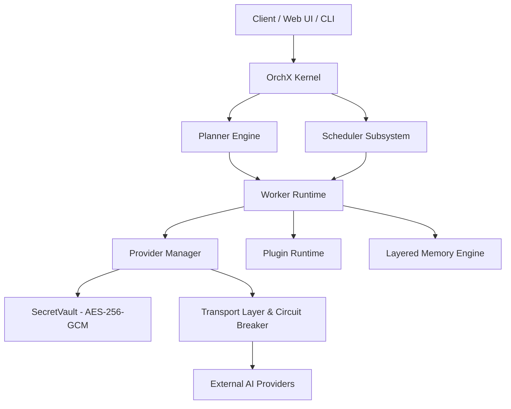

# OrchX — Enterprise AI Agent Orchestration Engine

[](LICENSE)
[](https://www.python.org/)
[](#architecture)

**OrchX** is a production-grade, modular AI Agent Orchestration platform designed for fault-tolerant multi-provider AI routing, secure credential management, layered memory persistence, and sandbox-safe plugin execution.

---

## Architecture Overview

OrchX follows a strictly decoupled, layered architecture to ensure scalability, enterprise security, and predictable runtime behavior.



### Core Subsystems

* **`orchx-core`**: Core contracts, domain interfaces, and event primitives.
* **`SecretVault`**: AES-256-GCM encrypted credential vault with strict context-bound `SecretAccessPolicy` enforcement and persistent audit logging.
* **`ProviderManager`**: Multi-provider LLM abstraction isolating transport, formatting, normalisation, and billing.
* **`TransportLayer`**: Resilient HTTP transport with integrated Circuit Breaker, exponential backoff retries, and latency telemetry.
* **`LayeredMemoryEngine`**: Multi-tier memory engine with SQLite persistence, semantic context assembly, and expiration cleanup.
* **`PluginRuntime`**: Subprocess-isolated tool execution sandbox supporting Git, Filesystem, Terminal, Python, Docker, and Browser automation.

---

## Core Capabilities & Advantages

OrchX is a full-featured, enterprise-grade orchestration engine designed for high-availability production workloads and complex multi-agent execution.

### Universal Multi-Provider Routing & Automatic Failover
* **20+ Integrated Providers**: Out-of-the-box support for OpenAI, Google Gemini, Groq, OpenRouter, NVIDIA NIM, DeepSeek, Mistral, Cohere, SiliconFlow, Cerebras, SambaNova, Cloudflare AI, and more.
* **Sub-Millisecond Circuit Breakers**: Built-in state-machine circuit breakers track real-time provider health. If an upstream provider degrades or rate-limits, OrchX instantly trips and reroutes requests without crashing downstream pipelines.
* **Dynamic Model Discovery**: Live capability inspection dynamically normalizes model lists, context window sizes, vision capabilities, tool-calling features, and pricing structures across all connected backends.

### Enterprise-Grade Zero-Trust Security (`SecretVault`)
* **AES-256-GCM Encryption**: Credentials never exist in plaintext on disk. Every secret key is cryptographically sealed using authenticated GCM mode with per-operation random nonces.
* **Context-Isolated RBAC (`SecretAccessPolicy`)**: Strict task-scoped authorization. AI models and adapters never directly see or handle raw credentials — all key access flows through context-bound runtime policies.
* **Cryptographic Audit Ledger**: Immutable logging of every secret operation (read, write, remove, rollback) with precise timestamping and caller attribution.

### Persistent Layered Memory & Context Builder
* **Multi-Tier Context Hierarchy**: Seamlessly manages Working Memory, Episodic Memory, and Long-Term Memory with automated TTL expiration cleanup.
* **SQLite-Backed Persistence**: Memory state survives application reboots, ensuring multi-step agent workflows maintain context across restarts.
* **Prompt Assembly Engine**: Intelligently trims, ranks, and injects relevant memory chunks to optimize context window utilization and reduce token costs.

### Sandboxed Subprocess Plugin Execution
* **Isolated Tool Execution Engine**: Execute real-world tools — Git, Filesystem, Terminal, Python, Node.js, Docker, and Browser Automation (Playwright) — inside controlled subprocesses.
* **Command Verification**: Built-in pattern guards block dangerous operations (`sudo`, `rm -rf /`, system directory modification).
* **Execution Timeout & Resource Protection**: Configurable per-task time limits prevent rogue scripts or infinite loops from consuming server resources.

### Precision Telemetry, Metrics & Cost Accounting
* **Granular Usage Tracking**: Tracks prompt tokens, completion tokens, first-byte latency (TTFT), total duration, and retry counts for every call.
* **Real-time Cost Estimation**: Computes usage costs on-the-fly using normalized provider pricing models for accurate tenant billing and observability.

---

## Quickstart

### Prerequisites

* Python 3.10+
* SQLite 3

### Installation

1. **Clone the repository:**
   ```bash
   git clone https://github.com/your-username/orchx.git
   cd orchx
   ```

2. **Set up Python environment:**
   ```bash
   python3 -m venv .venv
   source .venv/bin/activate
   pip install -e packages/orchx-core
   pip install -e packages/orchx-runtime
   ```

3. **Configure Environment Master Key:**
   ```bash
   # Generate a 256-bit AES base64 master key for SecretVault
   export ORCHX_MASTER_KEY=$(python3 -c "import base64, os; print(base64.b64encode(os.urandom(32)).decode('utf-8'))")
   export ORCHX_DB_PATH="runtime.db"
   ```

---

## Security Model

* **No Plaintext Storage**: Credentials are encrypted at rest using AES-256 GCM.
* **Context-Bound Authorization**: Access to vault keys requires a valid `SecretAccessPolicy` matching authorized service roles (`ProviderCredentialManager`, `AdminCLI`, `WebFrontend`).
* **Audit Logging**: Every read, write, and rollback operation in the vault is recorded in an immutable audit ledger.

---

## Repository Layout

```
orchx/
├── packages/
│   ├── orchx-core/        # Core interfaces and domain contracts
│   └── orchx-runtime/     # Subsystem implementations (Vault, Memory, Transport, Adapters)
├── plugins/                # Subprocess-isolated tool plugins
├── backend/                # API services
├── frontend/               # Web Interface
├── docs/                   # ADRs & Architecture documentation
├── LICENSE                 # MIT License
└── README.md
```

---

## License

This project is licensed under the **MIT License** — see the [LICENSE](LICENSE) file for details.
