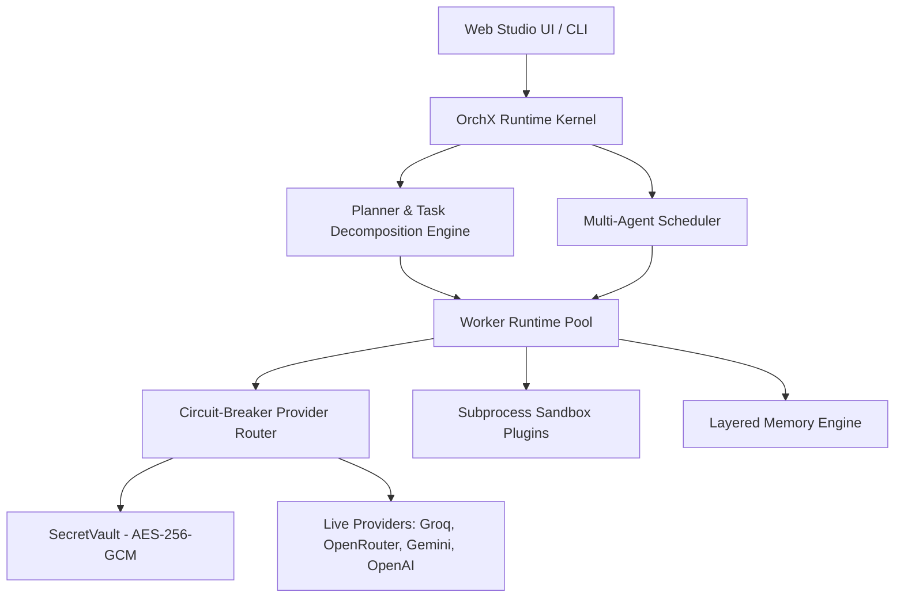

# OrchX — Enterprise Multi-Agent AI Orchestration Engine

[](LICENSE)
[](https://www.python.org/)
[](https://nextjs.org/)
[](https://tailwindcss.com/)
[](https://groq.com/)
[](https://openrouter.ai/)

**OrchX** is a production-grade, open-source AI Agent Orchestration platform designed for fault-tolerant multi-provider LLM routing, AES-256-GCM zero-trust credential isolation, layered memory persistence, interactive multi-agent node pipelines, and sandbox-safe plugin execution.

---

## 🚀 Quick Start Guide (Open Source Developers)

### 1. Prerequisites
* **Node.js**: v18.17+ or v20+
* **Python**: 3.10+
* **Git**: Installed
* **SQLite**: 3.x (Built into Python)

---

### 2. Full Local Installation

```bash
# 1. Clone the repository
git clone https://github.com/rishgotrizz/OrchX.git
cd OrchX

# 2. Set up Python Runtime & Virtual Environment
python3 -m venv .venv
source .venv/bin/activate
pip install -e packages/orchx-core
pip install -e packages/orchx-runtime
pip install -r packages/orchx-api/requirements.txt # or pip install -e packages/orchx-api

# 3. Generate a secure Master Encryption Key for SecretVault
# Run this command to generate a key, then save it in your `.env` file (see .env.example)
python3 -c "import base64, os; print(base64.b64encode(os.urandom(32)).decode('utf-8'))"

# 4. Start the backend API server
# Copy .env.example to .env, set ORCHX_MASTER_KEY, then run:
export $(cat .env | xargs)
PYTHONPATH=packages/orchx-core:packages/orchx-runtime:packages/orchx-api uvicorn orchx_api.main:app --host 127.0.0.1 --port 8000 --reload

# 5. Set up and start the Frontend Web Application
# In a new terminal tab/window:
cd frontend
npm install
npm run dev
```

Visit **`http://localhost:3000`** in your browser to access OrchX!

---

## 🔑 Managing API Keys in SecretVault

OrchX features a zero-trust credential vault (`SecretVault`). Raw API keys are **never stored in plaintext** or committed to source control. They can be added either directly through the **Settings Studio** UI page or using the command-line interface.

### Option A: Via the Settings Studio UI (Recommended)
1. Navigate to **`http://localhost:3000/settings-studio`** in your browser.
2. Select your AI provider from the listing.
3. Paste your API key and click **Verify & Save**.

### Option B: Via the SecretVault CLI
Activate your virtual environment and set your environment variables, then run:

```bash
# Add Groq API Key
python3 packages/orchx-runtime/bin/orchx_vault.py add groq gsk_YOUR_GROQ_API_KEY

# Add OpenRouter API Key
python3 packages/orchx-runtime/bin/orchx_vault.py add openrouter sk-or-v1-YOUR_OPENROUTER_KEY

# Add OpenAI API Key
python3 packages/orchx-runtime/bin/orchx_vault.py add openai sk-proj-YOUR_OPENAI_KEY

# Test Live Provider Connections & Health
python3 packages/orchx-runtime/bin/orchx_vault.py test groq
python3 packages/orchx-runtime/bin/orchx_vault.py test openrouter

# List Managed Providers (Keys are masked)
python3 packages/orchx-runtime/bin/orchx_vault.py list
```

---

## 🏛️ System Architecture



### Core Architecture Components

| Component | Directory | Description |
| :--- | :--- | :--- |
| **`orchx-core`** | `packages/orchx-core` | Core protocols, Pydantic contracts, domain interfaces, and event primitives. |
| **`orchx-runtime`** | `packages/orchx-runtime` | Subsystem implementations: `SecretVault`, `BaseRealProvider`, `LayeredMemory`, and `TransportLayer`. |
| **`Frontend App`** | `frontend` | Next.js 16 App Router interface featuring Mission Control, Workflow Forge, Runtime Observatory, Documents Studio, and Settings Studio. |
| **`Plugin Sandbox`** | `packages/orchx-runtime/builtin_plugins.py` | Subprocess isolation for Git, Filesystem, Terminal, Python, Docker, and Browser automation. |

---

## 🛠️ Main Feature Studios

1. **Mission Control (`/mission-control`)**:
   * Type any agentic goal (e.g. *"Build Calculator App"*, *"Build CRM Platform"*).
   * Automatically breaks goals down into **Autonomous Action Plans** and logs **Autonomous Decision Ledgers**.

2. **Workflow Forge (`/workflow-forge`)**:
   * Interactive `@xyflow/react` multi-agent node pipeline editor.
   * Dynamically renders nodes based on active Mission Control goals.
   * Real-time latency inspection and execution log streaming.

3. **Runtime Observatory (`/runtime-observatory`)**:
   * Live telemetry monitoring for kernel heartbeat, CPU load, and memory utilization.
   * Live API probe buttons for **Groq (255ms)** and **OpenRouter (1970ms, 337 models)**.
   * Active worker pool management (`groq-agent-01`, `openrouter-agent-01`, `gemini-agent-01`).

4. **Documents Studio (`/documents-studio`)**:
   * Categorized document vault spanning Product, Engineering, Research, AI Intelligence, and Output contracts.

5. **Settings Studio (`/settings-studio`)**:
   * Full provider API key management, model selection, temperature/max token tuning, circuit-breaker failover policies, security sandboxing, and UI appearance controls.

---

## 🧪 Verification & Testing

OrchX includes a comprehensive verification suite designed to check domain logic, API security boundaries, and integration paths.

### 1. Running Backend Unit & API Tests
Run the entire suite of 166 backend tests (fully mocked, no internet or provider credentials required):
```bash
PYTHONPATH=packages/orchx-core:packages/orchx-runtime:packages/orchx-api pytest packages/orchx-runtime/tests/ packages/orchx-api/tests/
```

### 2. Optional Live Provider Integration Tests
To verify real connection paths, authentication, and HTTP transport payloads against active external AI LPUs (e.g. Groq):
```bash
export ORCHX_RUN_LIVE_PROVIDER_TESTS=true
export ORCHX_MASTER_KEY="your-base64-master-key"
export ORCHX_TEST_GROQ_API_KEY="gsk_your_groq_api_key_here"

PYTHONPATH=packages/orchx-core:packages/orchx-runtime:packages/orchx-api pytest packages/orchx-api/tests/test_real_integration.py
```
*Note: This test is skipped by default unless `ORCHX_RUN_LIVE_PROVIDER_TESTS=true` is explicitly set.*

---

## 🌐 Deploying to Production (Vercel)

OrchX is fully configured for zero-configuration Vercel deployment:

1. Push your repository to GitHub:
   ```bash
   git push origin main
   ```
2. Connect your repository in the [Vercel Dashboard](https://vercel.com).
3. Set Root Directory to `frontend`.
4. Deploy! Live demo: **[https://orch-x.vercel.app/](https://orch-x.vercel.app/)**

---

## 🔒 Security Best Practices

OrchX utilizes a zero-trust model to manage external AI provider keys:
* **Never commit `.env` or `.env.*` files** to your repository. They are ignored by default via `.gitignore`.
* **Never hardcode provider API keys** in any source code, frontends, or tests.
* **Rotate any key accidentally exposed**. If an API key is accidentally committed, rotate and revoke it immediately at the provider's dashboard. Simply deleting the secret from your latest commit **does not invalidate it** as it remains accessible in the Git history.
* **Secret Scanning**: We recommend configuring automated secret scanning (e.g. GitHub Secret Scanning) to prevent credentials leakage.

---

## 🤝 Contributing & License

We welcome open-source contributions! Feel free to open issues or submit pull requests.

* **License**: MIT License — free for personal and commercial usage.
